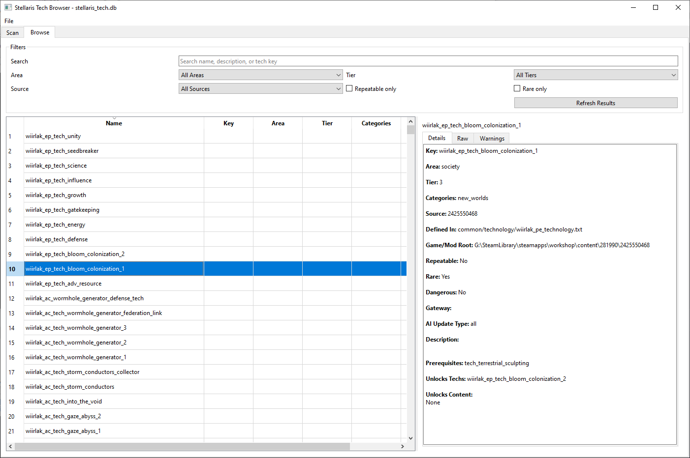

# Stellaris Tech Browser

A Python + PyQt6 desktop application that scans a Stellaris installation and optional mods folder, parses technology data into SQLite, and provides a desktop browser for searching and inspecting the tech graph.
It also identifies issues and collisions in the techtree.



## Features

- Select a Stellaris **game folder** and optional **mods folder**
- Scan `common/technology` plus a broad set of tech-related unlockable folders
- Parse localisation from `localisation/*.yml`
- Build a normalized **SQLite database**
- Browse technologies by search, area, tier, source, repeatable, and rare flags
- Inspect prerequisites, reverse unlocks, source provenance, and raw parsed data
- Export the scanned database to a JSON graph file
- Progress bar and scan log during extraction

## Project Layout

- `run.py` - app entry point
- `stellaris_tech_browser/main.py` - Qt app bootstrap
- `stellaris_tech_browser/scanner.py` - scanner and database writer
- `stellaris_tech_browser/clausewitz_parser.py` - lightweight Clausewitz-style parser
- `stellaris_tech_browser/db.py` - SQLite schema and helpers
- `stellaris_tech_browser/exporters.py` - JSON export from the SQLite DB
- `stellaris_tech_browser/ui/main_window.py` - main window and browser UI

## Requirements

- Python 3.11+
- PyQt6

Install:

```bash
pip install -r requirements.txt
```

## Run

```bash
python run.py
```

## Typical Usage

1. Open the app.
2. In the **Scan** tab, select your Stellaris game folder.
3. Optionally select a mods folder.
4. Choose an output database path.
5. Click **Scan and Build Database**.
6. After completion, the **Browse** tab opens automatically.
7. Use **File -> Export JSON** if you also want a JSON export.

## Notes

- Stellaris script syntax is broad; this parser is designed for common technology-style files and many related data files, but some edge-case mod scripting patterns may still need follow-up improvements.
- Technologies are modeled as a directed graph through the `technology_prerequisites` table.
- Unlockable linking is currently heuristic-based by scanning for `tech_*` references inside known content folders.
- The scanner preserves raw parsed blocks in the database so the browser can show underlying source data even when a field is not yet normalized.

## Database Output

The generated SQLite DB includes tables for:

- sources
- files
- technologies
- technology_categories
- technology_prerequisites
- unlockables
- technology_unlocks
- localisation
- scan_runs
- warnings
- technology_search (FTS5)


